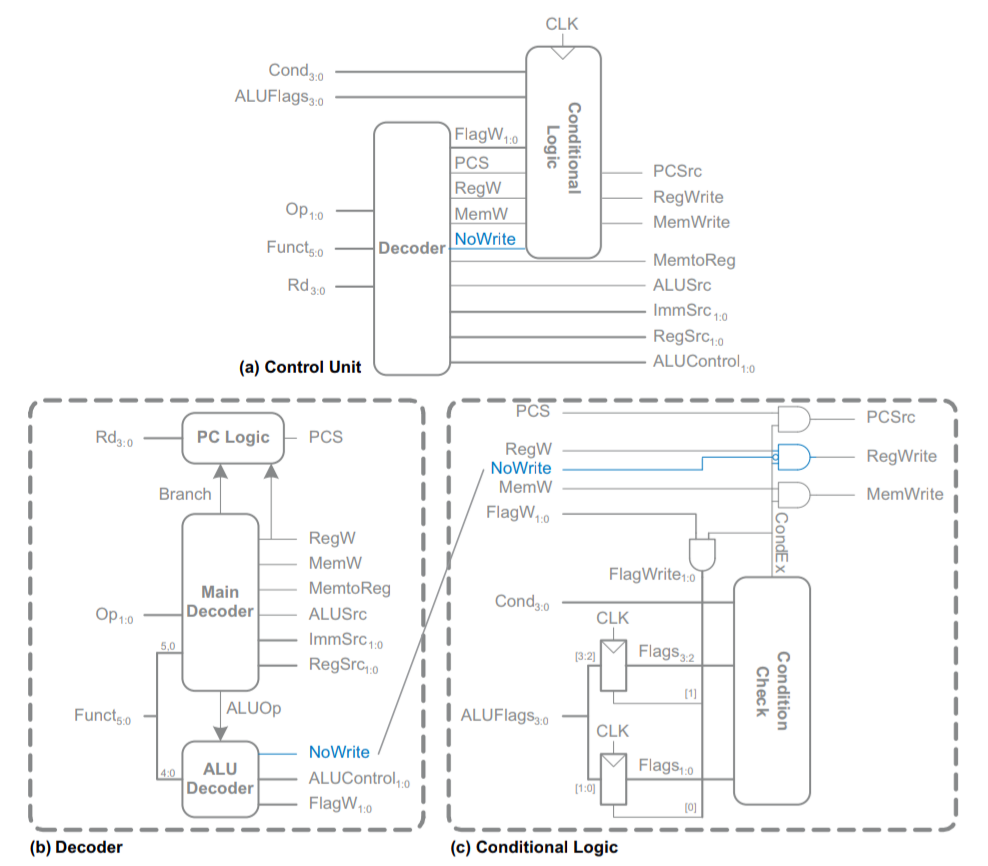
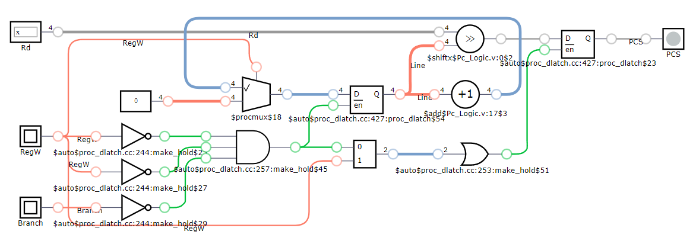
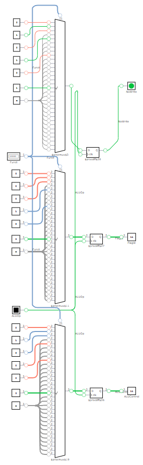
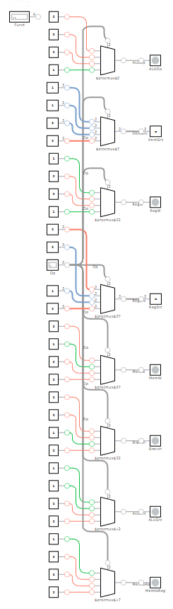
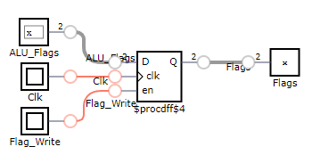
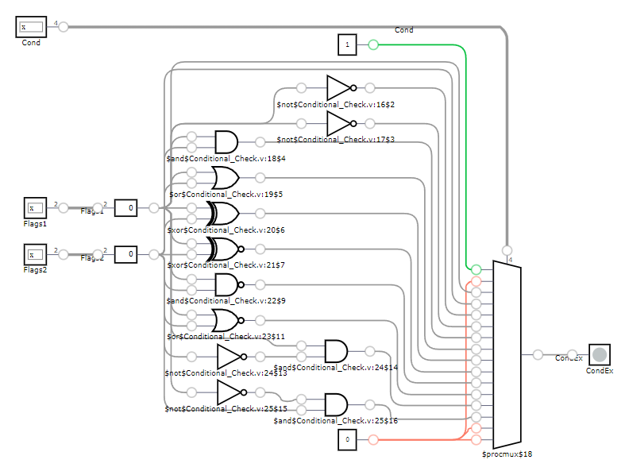
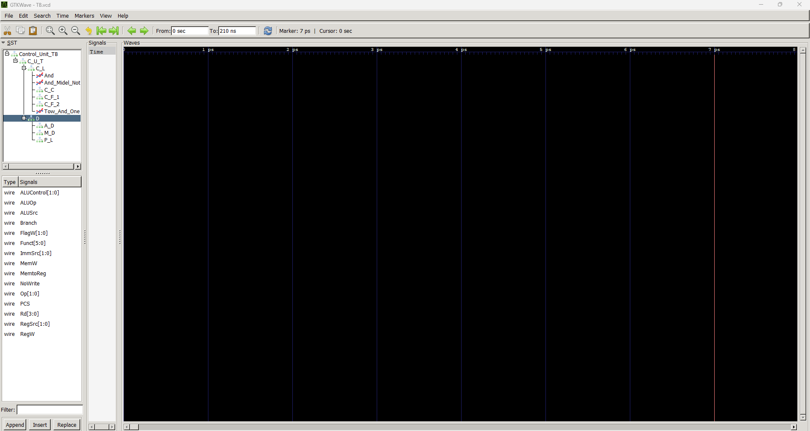

# Logic Circuit Lab Project
### Circuit photo:

---
### Circuit sections:
1. Decoder
   * [Pc Logic](#Pc-Logic)
   * [ALU Decoder](#ALU-Decoder)
   * [Main Decoder](#Main-Decoder)
3. Conditional Logic
   * [Clk Flags](#Clk-Flags)
   * [Conditional Check](#Conditional-Check)
### Integrated circuits:
1. Decoder
   * [Decoder](#Decoder)
2. Conditional_Logic
   * [Conditional Logic](#Conditional-Logic)
3. Conditional_Logic
   * [Control Unit](#Control-Unit)
### Bench test:
1. Conditional_Logic
   * [Control Unit TB](#Control-Unit-TB)
### Tip:
1. d
2. d
3. d
---

### Pc Logic:

#### Pc Logic photo:

#### Description:
وظیفه این واحد کنترل خطی از برنامه است که قرار است خوانده شود و در صورت وجود Branch همیشه خط بعدی خوانده میشود و در صورت وجود RegW برنامه ریست میشود.

---

### ALU Decoder:

#### ALU Decoder photo:

#### Description:
با وجود ALUOp همیشه با سویچ روی Funct سیگنال های کنترلی مختلف رو برای واحد کنترل ایجاد میکنه ولی از 32 حالت ممکن تعدادی از حالات نوشته شده.

---

### Main Decoder:

#### Main Decoder photo:

#### Description:
این واحد در واقعیت وظیفه ایجاد سیگنال های کنترلی برای ALU و حافظه را دارد و مسیر خواندن خط های برنامه را هم کنترل میکند که در اینجا برخی از حالت های ایجاد سیگنال ها امده.

---

### Clk Flags:

#### Clk Flags photo:

#### Description:
با وجود Clk و Flag Write مقدار Flags در لبه بالا رونده کلاک مساوی با ALU Flags قرار میگیرد.

---

### Conditional Check:

#### Conditional Check photo:

#### Description:
با وجود Cond منطق های مختلف از جمله And رو بر روی متغیر های دو بیت Flags1 و Flags2 اعمال و بیت با ارزش ان را درون CondEx قرار میدهد.

---

### Decoder:

#### Decoder photo:
.png)

#### Description:
وظیفه ان تنها یکپارچگی مدار های Pc Logic و ALU Decoder و Main Decoder را بر عهده دارد.

---

### Conditional Logic:

#### Conditional Logic photo:
.png)

#### Description:
وظیفه ان یکپارچگی مدار های Clk Flags و Conditional Check و ایجاد منطق Aad دو متغیر و سه متغیر که متغیر میانی را Not میکند و And دو متغیر که یک متغیر دو بیت و یک متغیر تک بیت است یعنی متغیر تک بیتی با هر دو بیت متغیر دو بیتی And و نتیجه ذخیره میشود.

---

### Control Unit:

#### Control Unit photo:
.png)

#### Description:
وظیفه ان ایجاد یک مدار مجتمع بین Decoder و Conditional Logic است که یک مدار Control Unit ایجاد میکند. 

---

### Control Unit TB:

#### Control Unit TB photo:

#### Description:
ایجاد یک تست بنچ که در واحد های زمانی 5 نانو ثانیه کلاک ایجاد و در واحد های زمانی 10 نانو ثانیه چند نمونه از حالت های مختلف ممکن برای وردی رو به مدار Control Unit داده و خروجی رو دریافت میکند.

---

### 1:
#### Description:

### 2:
#### Description:

### 3:
#### Description:
